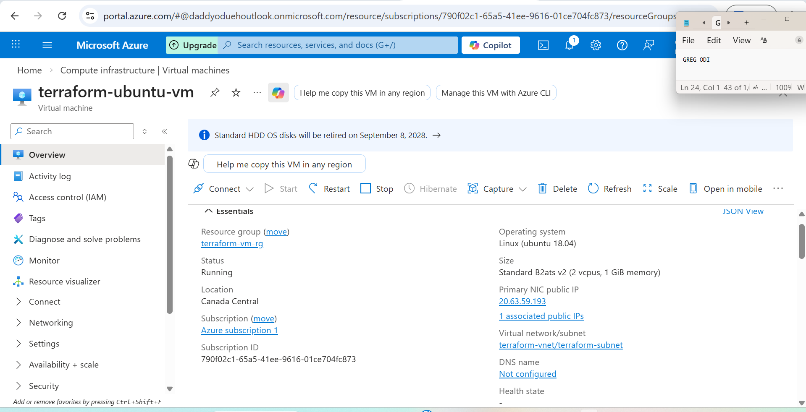

# 🚀 Terraform Azure VM Deployment


> Deploy a fully configured Ubuntu Virtual Machine on Microsoft Azure using 
> Terraform — complete with networking, security groups, and a public IP. 
> Provisioned in **Canada Central** in under 5 minutes.

---

## 📸 Live Deployment

<!-- SCREENSHOT 1: Paste your Azure portal screenshot here -->
<!-- Example:  -->

---

## 📋 What Gets Deployed

| Resource | Name | Details |
|---|---|---|
| Resource Group | terraform-vm-rg | Canada Central |
| Virtual Network | terraform-vnet | 10.0.0.0/16 |
| Subnet | terraform-subnet | 10.0.1.0/24 |
| Public IP | terraform-public-ip | Static, Standard SKU |
| Network Security Group | terraform-nsg | SSH port 22 inbound |
| Network Interface | terraform-nic | Dynamic private IP |
| NIC/NSG Association | nic_nsg | Bound to NIC |
| Linux Virtual Machine | terraform-ubuntu-vm | Ubuntu 18.04 LTS |

---

## 🖥️ VM Specifications

| Property | Value |
|---|---|
| **VM Size** | Standard_B2ats_v2 |
| **vCPUs** | 2 |
| **Memory** | 1 GiB |
| **OS** | Ubuntu Server 18.04 LTS |
| **Region** | Canada Central |
| **Authentication** | Password-based |
| **Cost** | ~$7.67/month (free tier eligible) |

---

## ✅ Prerequisites

Before you begin make sure you have:

- [ ] [Terraform](https://developer.hashicorp.com/terraform/downloads) installed
- [ ] [Azure CLI](https://learn.microsoft.com/en-us/cli/azure/install-azure-cli) installed
- [ ] An active Azure subscription
- [ ] Azure CLI authenticated (`az login --use-device-code`)
- [ ] A Service Principal with Contributor role

---

## 🔐 Step 1 — Azure CLI Login
```bash
# Clear any old session data
az logout
az account clear

# Login using device code (works on WSL and all environments)
az login --use-device-code
```

Open `https://microsoft.com/devicelogin` in your browser, enter the
code shown in your terminal, sign in, and close the tab.
```bash
# Confirm active subscription
az account show --output table

# Save these IDs — you will need them
az account show --query id --output tsv        # Subscription ID
az account show --query tenantId --output tsv  # Tenant ID
```

---

## 🔑 Step 2 — Service Principal Setup
```bash
# Check if one already exists
az ad sp list --display-name "terraform" --output table
```

**If it does NOT exist — create one:**
```bash
az ad sp create-for-rbac \
  --name "terraform" \
  --role "Contributor" \
  --scopes "/subscriptions/<YOUR_SUBSCRIPTION_ID>" \
  --output json
```

Save the output — the `password` is shown **only once**:
```json
{
  "appId":       "yyyyyyyy-yyyy-yyyy-yyyy-yyyyyyyyyyyy",
  "displayName": "terraform",
  "password":    "your~generated~secret",
  "tenant":      "zzzzzzzz-zzzz-zzzz-zzzz-zzzzzzzzzzzz"
}
```

**If it already exists — reset credentials:**
```bash
az ad sp credential reset --id <APP_ID> --output json

az role assignment create \
  --assignee <APP_ID> \
  --role "Contributor" \
  --scope "/subscriptions/<YOUR_SUBSCRIPTION_ID>"
```

**Verify SP and role assignment:**
```bash
az ad sp show --id <APP_ID> \
  --query "{Name:displayName, Enabled:accountEnabled}" \
  --output table

az role assignment list \
  --assignee <APP_ID> \
  --query "[].{Role:roleDefinitionName, Scope:scope}" \
  --output table
```

---

## 💾 Step 3 — Store Credentials Permanently
```bash
nano ~/.bashrc
```

Add at the very bottom:
```bash
# Terraform Azure Service Principal
export ARM_CLIENT_ID="<YOUR_APP_ID>"
export ARM_CLIENT_SECRET="<YOUR_PASSWORD>"
export ARM_SUBSCRIPTION_ID="<YOUR_SUBSCRIPTION_ID>"
export ARM_TENANT_ID="<YOUR_TENANT_ID>"
```

Apply immediately:
```bash
source ~/.bashrc
printenv | grep ARM_
```

---

## 📁 Step 4 — Clone and Configure
```bash
git clone https://github.com/<YOUR_USERNAME>/terraform-azure-vm.git
cd terraform-azure-vm
```

The `main.tf` file is ready to use. No edits needed — 
credentials are read from your environment variables automatically.

---

## 🚀 Step 5 — Deploy
```bash
# Initialize — downloads AzureRM provider
terraform init

# Preview all 8 resources before creating anything
terraform plan

# Deploy to Azure (takes 3–5 minutes)
terraform apply
```

Type `yes` when prompted. Expected output:
```
Apply complete! Resources: 8 added, 0 changed, 0 destroyed.

Outputs:

public_ip_address = "xx.xx.xx.xx"
ssh_command       = "ssh azureuser@xx.xx.xx.xx"
vm_name           = "terraform-ubuntu-vm"
```

<!-- SCREENSHOT 2: Paste terraform apply output screenshot here -->

---

## ✔️ Step 6 — Verify
```bash
# Confirm VM is running
az vm list -d \
  --query "[].{Name:name, Status:powerState}" \
  --output table

# Get public IP
terraform output public_ip_address
```

<!-- SCREENSHOT 3: Paste az vm list output screenshot here -->

---

## 🗑️ Step 7 — Destroy

When you are finished, remove all resources to avoid charges:
```bash
terraform destroy
```

Type `yes` when prompted.
```
Destroy complete! Resources: 8 destroyed.
```

<!-- SCREENSHOT 4: Paste terraform destroy screenshot here -->

---

## 📂 Project Structure
```
terraform-azure-vm/
├── main.tf          # Complete infrastructure definition
├── .gitignore       # Protects state files and secrets
└── README.md        # This file
```

---

## ⚠️ Security Notes

- Never commit `terraform.tfstate` — it contains sensitive infrastructure data
- Never commit `.tfvars` files containing real credentials
- Always use environment variables or a secrets manager for credentials
- The `.gitignore` in this repo already excludes all sensitive files

---

## 📖 Full Article

Read the complete step-by-step guide including troubleshooting tips
on Medium:

<!-- MEDIUM LINK: Replace with your actual Medium post URL -->
[Read the full guide on Medium →](<YOUR_MEDIUM_LINK>)

---

## 👤 Author

**Greg ODI**
- GitHub: [@<YOUR_USERNAME>](https://github.com/<YOUR_USERNAME>)
- Medium: [@<YOUR_MEDIUM_HANDLE>](https://medium.com/@<YOUR_MEDIUM_HANDLE>)

---

## 📄 License

This project is licensed under the MIT License.
Feel free to use, modify, and distribute freely.
